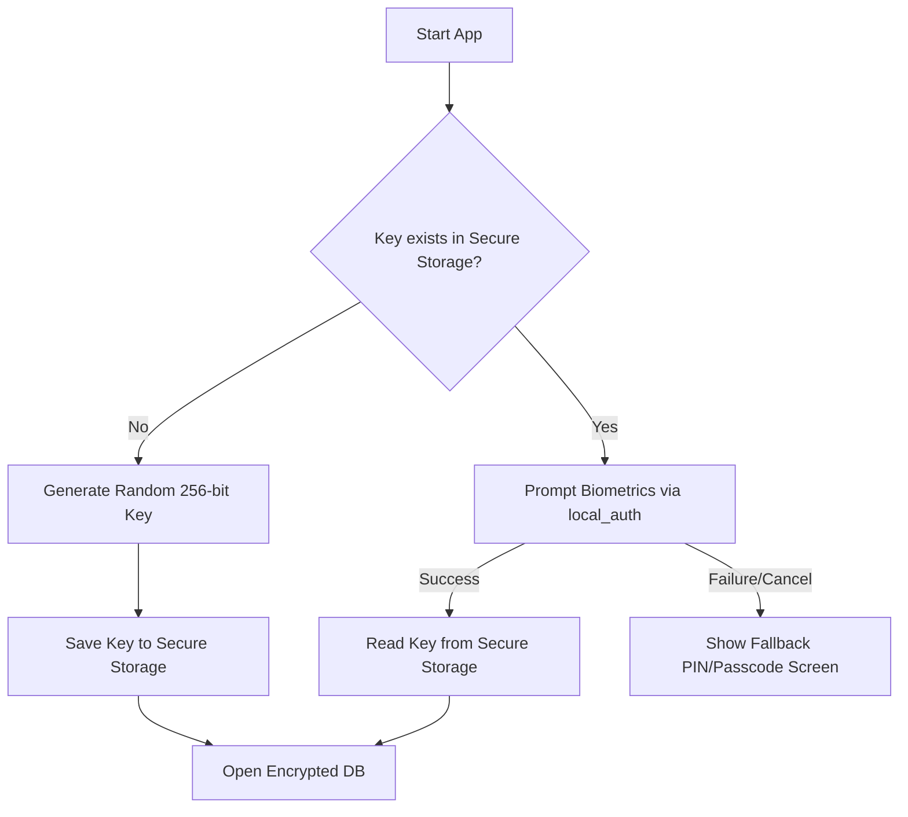
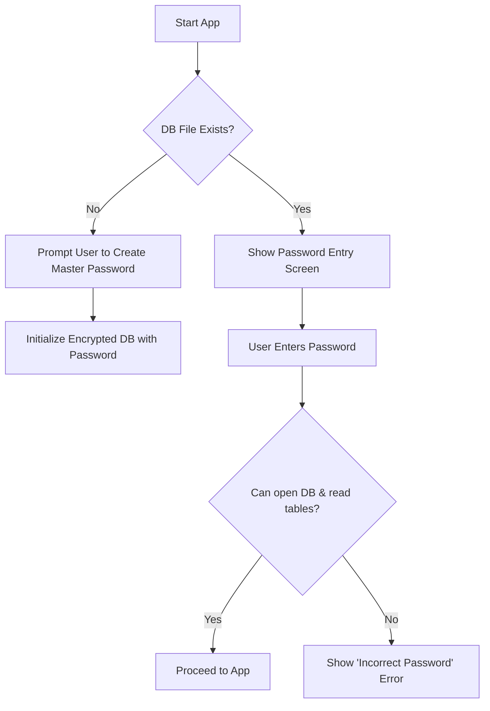
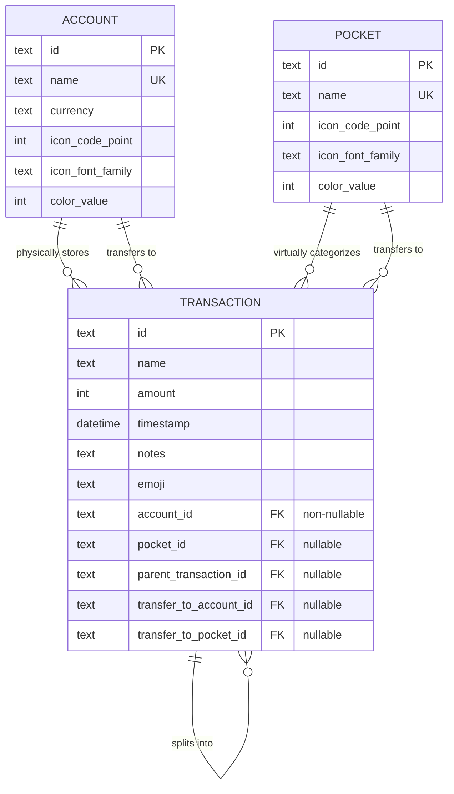

# Encrypted Local Persistence with Drift & SQLite

This implementation plan outlines the path to add encrypted local SQLite database persistence to the Trenni application using **Drift** and **SQLite3MultipleCiphers** (via `sqlite3` build hooks), with specialized biometric key protection on mobile/macOS, password authentication on Windows, and **Riverpod** as the reactive state management layer. All tables use client-generated **UUIDs** as primary keys for future synchronization capabilities.

---

## Technical Stack & Packages

We will use the following packages to implement local encryption, secure authentication, and robust data schema:

1. **Database Layer:**
   - **`drift` & `drift_dev`**: For modern, type-safe reactive database queries.
   - **`sqlite3`**: SQLite bindings configured via build hooks to build with **SQLite3MultipleCiphers (`sqlite3mc`)**.
   - **`path_provider` & `path`**: To locate standard application directories across platforms.
   - **`uuid`**: To generate cryptographically secure UUID v4 strings for all table primary keys.
2. **Key Security & Biometrics:**
   - **`local_auth`**: Official plugin for native biometric prompts (Face ID & Touch ID on iOS/macOS, `BiometricPrompt` on Android).
   - **`flutter_secure_storage`**: For storing the database encryption key securely (Keychain on iOS/macOS, Keystore on Android, and DPAPI on Windows).
3. **State Management:**
   - **`flutter_riverpod`**: For scalable, compile-time safe dependency injection and reactive stream-to-UI bindings.

---

## Architecture & Authentication Workflows

### Mobile & macOS Workflow (Biometric-First)
On Android, iOS, and macOS, a cryptographically secure random 256-bit key is generated upon first install, stored in secure system hardware, and subsequently unlocked via biometric authorization.



### Windows Workflow (Password-First)
On Windows, the application requires a master password to initialize or open the database. SQLite3MultipleCiphers uses a Key Derivation Function (KDF) internally to secure the database.



---

## Decoupled Virtual Envelope Budgeting Architecture

To support modern financial practices, we decouple **where your money physically lives** (Accounts) from **what your money is budgeted to do** (Pockets):

1. **Virtual Envelopes (Pockets Spanning Accounts)**:
   - **Pockets** are virtual categories (e.g. *Groceries*, *Savings*, *Travel*) that exist independently and can span multiple Accounts.
   - **Accounts** represent physical financial containers (e.g., *Checking*, *Credit Card*).
   - A single transaction connects a physical container (`account_id`) to a budget envelope (`pocket_id`). This allows a user to buy groceries using either Checking or a Credit Card while tracking it under a single "Groceries" budget.
2. **Ledger-as-Source-of-Truth**:
   - Accounts and Pockets do **not** store pre-compiled balances or limits.
   - **Account Balance** is computed dynamically by summing all transaction amounts linked to `account_id`.
   - **Pocket Balance/Spent** is computed dynamically by summing all transaction amounts linked to `pocket_id`.
3. **Exact Integer Cents (No Float Rounding Errors)**:
   - Amounts are stored in SQLite as **`INTEGER` cents** (e.g. `$10.50` is stored as `1050`) to eliminate double precision floating-point inaccuracies.
   - Drift's `AmountConverter` maps these integers back to Dart `double` values automatically in our models.

---

## Proposed Changes

We will introduce Drift and Riverpod, set up compilation hooks, design the database schema, implement providers, configure platform-native layers, and refactor the UI to inherit from `ConsumerWidget` classes.

### Dependency & Hook Configuration

We will add the necessary dependencies to `pubspec.yaml` and configure the compiler hooks to bundle `sqlite3mc` instead of upstream SQLite.

#### [MODIFY] [pubspec.yaml](file:///Users/alexandre/Documents/Code/trenni/add-local-persistence/pubspec.yaml)
* Add `drift`, `path_provider`, `path`, `flutter_secure_storage`, `local_auth`, `flutter_riverpod`, and `uuid` to `dependencies`.
* Add `drift_dev` and `build_runner` to `dev_dependencies`.
* Add the `hooks` top-level block to configure compilation to use `sqlite3mc`:
  ```yaml
  hooks:
    user_defines:
      sqlite3:
        source: sqlite3mc
  ```

---

### Native Platform Configurations (Biometrics & Sandbox Security)

To prevent runtime crashes and allow Face ID / Biometric Prompt configurations, we must update the native platform files:

#### [MODIFY] [ios/Runner/Info.plist](file:///Users/alexandre/Documents/Code/trenni/add-local-persistence/ios/Runner/Info.plist) & [macos/Runner/Info.plist](file:///Users/alexandre/Documents/Code/trenni/add-local-persistence/macos/Runner/Info.plist)
* Add the biometric usage description required by iOS/macOS sandbox policies to prevent instant termination:
  ```xml
  <key>NSFaceIDUsageDescription</key>
  <string>Trenni requires biometric authentication to secure your local encrypted database.</string>
  ```

#### [MODIFY] [android/app/src/main/AndroidManifest.xml](file:///Users/alexandre/Documents/Code/trenni/add-local-persistence/android/app/src/main/AndroidManifest.xml)
* Add the biometric hardware permission to the manifest:
  ```xml
  <uses-permission android:name="android.permission.USE_BIOMETRIC"/>
  ```

#### [MODIFY] [android/app/src/main/kotlin/com/example/trenni/MainActivity.kt](file:///Users/alexandre/Documents/Code/trenni/add-local-persistence/android/app/src/main/kotlin/com/example/trenni/MainActivity.kt)
* Refactor the standard `FlutterActivity` to extend **`FlutterFragmentActivity`** (required by `local_auth` to display the fragment-based `BiometricPrompt` window):
  ```kotlin
  import io.flutter.embedding.android.FlutterFragmentActivity

  class MainActivity: FlutterFragmentActivity() {
  }
  ```

---

### Database Schema Design (Decoupled, UUID-based)

We will model three tables: `pockets`, `accounts`, and `transactions` using Drift's DSL, with UUID text keys, exact currency storage, splits, and custom emoji customization.



#### [NEW] [database.dart](file:///Users/alexandre/Documents/Code/trenni/add-local-persistence/lib/database/database.dart)
This file will contain the table definitions, amount converter, typed relation class, encryption initialization, and access queries.

Key segments:
* **Amount Converter & Relation Class**:
  ```dart
  import 'package:drift/drift.dart';

  class AmountConverter extends TypeConverter<double, int> {
    const AmountConverter();
    @override
    double fromSql(int fromDb) => fromDb / 100.0;
    @override
    int toSql(double value) => (value * 100).round();
  }

  // Unified class returned by reactive streams for simple UI binding
  class TransactionWithRelations {
    final Transaction transaction;
    final Account account;
    final Pocket? pocket;
    final Account? transferToAccount;
    final Pocket? transferToPocket;

    TransactionWithRelations({
      required this.transaction,
      required this.account,
      this.pocket,
      this.transferToAccount,
      this.transferToPocket,
    });
  }
  ```
* **Tables definitions**:
  ```dart
  import 'package:uuid/uuid.dart';

  class Pockets extends Table {
    TextColumn get id => text().clientDefault(() => const Uuid().v4())();
    TextColumn get name => text().unique()();
    IntColumn get iconCodePoint => integer()();
    TextColumn get iconFontFamily => text().nullable()();
    IntColumn get colorValue => integer().nullable()();

    @override
    Set<Column> get primaryKey => {id};
  }

  class Accounts extends Table {
    TextColumn get id => text().clientDefault(() => const Uuid().v4())();
    TextColumn get name => text().unique()();
    TextColumn get currency => text().withLength(min: 3, max: 3)(); // ISO 4217 code (e.g. 'USD')
    IntColumn get iconCodePoint => integer()();
    TextColumn get iconFontFamily => text().nullable()();
    IntColumn get colorValue => integer().nullable()();

    @override
    Set<Column> get primaryKey => {id};
  }

  class Transactions extends Table {
    TextColumn get id => text().clientDefault(() => const Uuid().v4())();
    TextColumn get name => text()();
    IntColumn get amount => integer().map(const AmountConverter())(); // Exact cents storage
    DateTimeColumn get timestamp => dateTime()();
    TextColumn get notes => text().nullable()();
    TextColumn get emoji => text().nullable()(); // Custom unicode character string
    
    // 1. Physical Layer (Non-nullable)
    TextColumn get accountId => text().references(Accounts, #id, onDelete: KeyAction.cascade)();
    
    // 2. Budget Layer (Nullable, for uncategorized entries)
    TextColumn get pocketId => text().nullable().references(Pockets, #id, onDelete: KeyAction.setNull)();
    
    // 3. Optional Split Hierarchy
    TextColumn get parentTransactionId => text().nullable().references(Transactions, #id, onDelete: KeyAction.cascade)();

    // 4. Optional Transfers across accounts and/or pockets
    TextColumn get transferToAccountId => text().nullable().references(Accounts, #id, onDelete: KeyAction.setNull)();
    TextColumn get transferToPocketId => text().nullable().references(Pockets, #id, onDelete: KeyAction.setNull)();

    @override
    Set<Column> get primaryKey => {id};
  }
  ```
* **Connection & Encryption Setup**:
  We will implement the setup function to open the database in the background, check for SQLite3MultipleCiphers via `PRAGMA cipher;`, and set the passphrase:
  ```dart
  LazyDatabase openConnection(String passphrase) {
    return LazyDatabase(() async {
      final dbFolder = await getApplicationDocumentsDirectory();
      final file = File(p.join(dbFolder.path, 'trenni.db'));
      return NativeDatabase.createInBackground(
        file,
        setup: (rawDb) {
          assert(_debugCheckHasCipher(rawDb), 'SQLite3MultipleCiphers is not available! Verify your build hooks.');
          rawDb.execute("PRAGMA key = '${passphrase.replaceAll("'", "''")}';");
        },
      );
    });
  }

  bool _debugCheckHasCipher(Database database) {
    return database.select('PRAGMA cipher;').isNotEmpty;
  }
  ```

---

### Application Architecture & Riverpod Providers

We will construct a modular provider structure to feed the UI with reactive database data.

#### [NEW] [providers.dart](file:///Users/alexandre/Documents/Code/trenni/add-local-persistence/lib/database/providers.dart)
This file will contain all of Riverpod's declarative providers for our persistence layer:

* **`databaseProvider`**: A base provider that keeps the active initialized `AppDatabase` instance.
  ```dart
  final databaseProvider = Provider<AppDatabase>((ref) => throw UnimplementedError());
  ```
* **`pocketsProvider`**: A `StreamProvider<List<Pocket>>` that watches pocket list changes.
  ```dart
  final pocketsProvider = StreamProvider<List<Pocket>>((ref) {
    final db = ref.watch(databaseProvider);
    return db.watchPockets();
  });
  ```
* **`accountsProvider`**: A `StreamProvider<List<Account>>` that watches account list changes.
  ```dart
  final accountsProvider = StreamProvider<List<Account>>((ref) {
    final db = ref.watch(databaseProvider);
    return db.watchAccounts();
  });
  ```
* **`transactionsProvider`**: A `StreamProvider<List<TransactionWithRelations>>` that watches transactions and maps them with foreign key UUIDs.
  ```dart
  final transactionsProvider = StreamProvider<List<TransactionWithRelations>>((ref) {
    final db = ref.watch(databaseProvider);
    return db.watchTransactionsWithRelations();
  });
  ```

#### [NEW] [database_service.dart](file:///Users/alexandre/Documents/Code/trenni/add-local-persistence/lib/database/database_service.dart)
A service helper class to orchestrate platform-specific biometrics and password challenges before providing the DB instance to Riverpod:
* Provides native `local_auth` bindings.
* Manages `flutter_secure_storage` access.
* Returns an initialized `AppDatabase` instance once successfully decrypted.

---

### UI Integration

We will wire up the authentication flow, Settings screen, and refactor the main views.

#### [NEW] [auth_screen.dart](file:///Users/alexandre/Documents/Code/trenni/add-local-persistence/lib/screens/auth_screen.dart)
A premium startup credentials screen matching the app's dark/light design system:
* On Mobile/macOS: Displays standard biometrics triggers with a PIN fallback.
* On Windows: Sleek input validation form requesting the Master Password.

#### [NEW] [settings_screen.dart](file:///Users/alexandre/Documents/Code/trenni/add-local-persistence/lib/screens/settings_screen.dart)
A new settings viewport including:
* Standard user preferences (appearance, account details).
* A specialized **"Debug Tools"** section containing:
  - **"Seed Mock Data"** row entry. When tapped, it deletes existing records and seeds the database with the pre-coded groceries, entertainment pockets, Netflix/salary transactions, etc., to allow rapid developer testing.

#### [MODIFY] [main.dart](file:///Users/alexandre/Documents/Code/trenni/add-local-persistence/lib/main.dart)
* Wrap the app's root in a `ProviderScope`.
* Load and inject the database instance into `databaseProvider` once authentication is successful, then route from `AuthScreen` to `HomeScreen`.

#### [MODIFY] [home_screen.dart](file:///Users/alexandre/Documents/Code/trenni/add-local-persistence/lib/screens/home_screen.dart)
* Convert `HomeScreen` and its sub-widgets (`_PocketsSection`, `_AccountsSection`, `_TransactionsSection`) into **`ConsumerWidget`** classes.
* Direct settings button (top right icon) to push `SettingsScreen` to the navigation stack.
* Watch the corresponding stream providers (e.g. `ref.watch(pocketsProvider)`) and cleanly handle loading and error states using Riverpod's `when` pattern.
* Construct the dynamic `_BalanceGraph` dynamically from the historic transaction stream provider.

---

## Verification Plan

We will verify both the functional correct behavior of local persistence and the structural security of the SQLite encryption layer.

### Automated Verification
* **Unit Tests**:
  - Create a memory-based database test suite (`ffi` in-memory executor) to verify CRUD operations, schema migrations, and relationship integrity using UUID keys.
  - Verify that integer cents calculations are exact and float conversion is error-free.
  - Verify that attempting to open the database with an incorrect passphrase fails with a SQLite exception (proving it is indeed encrypted).
  - Verify Riverpod providers emit the correct state when underlying data updates.
* **Integration Tests**:
  - Run the existing integration tests and add database check-outs to verify database states after user events.

### Manual Verification
* **Encryption Check**:
  - Pull the database file `trenni.db` from the device/simulator documents folder.
  - Try opening it with a standard SQLite editor (e.g. DB Browser for SQLite) without a key. It must report a corrupted database or request a password.
  - Open it using SQLite3MultipleCiphers with the correct key and verify the schema and tables are fully visible and readable.
* **UI Persistence & Seeding**:
  - Navigate to the top-right Settings icon -> Debug -> trigger "Seed Mock Data". Verify that the home screen immediately and reactively loads all mock cards and transactions.
  - Verify that adding a transaction or updating a pocket/account updates the UI instantly.
  - Restart the application and verify that all data persists exactly as left off.
